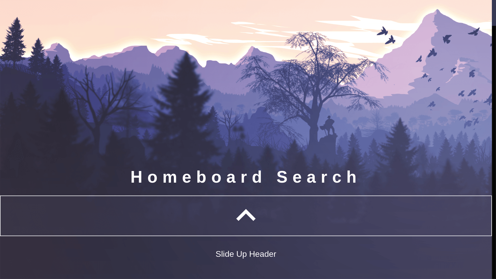
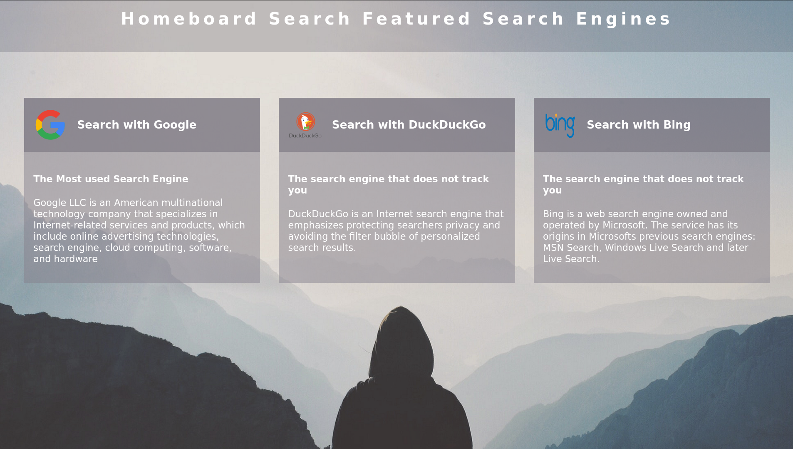

# **Deprecated! I don't support or update this Applcation**

## Homeboard Search

### Metasearchengine using React and Node

Metasearch engine Reactjs Frontend, Nodejs Backend. A custom Searchquery was sent to Google, Bing and DuckDuckGo API.Results are Displayed in the Dashboard.

### Structure

#### server

1. Technologies

- nodejs
- express
- /api/DuckDuckGo
- /api/googlesearch
- /api/bing

### client

- react

Readme:
updated 2020
